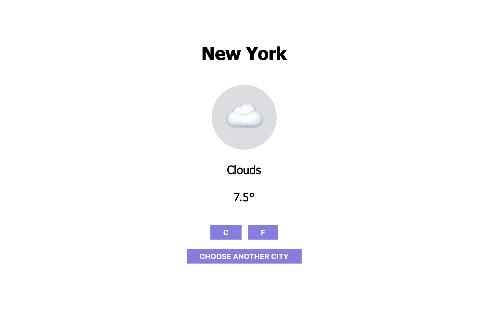

# Weather app

This app is able to provide you temperature information based on the city or region provided.  

This project is created to practice and get more familiar with API's and async functions, promises end etc. 

You can find the original description in [The Odin Project](https://www.theodinproject.com/courses/javascript/lessons/weather-app)

## Built With

- Javascript, HTML, CSS
- Webpack

## Live Demo

[Live Demo Link](https://htmlpreview.github.io/?https://github.com/webmarkyn/weather-app/blob/feature/weather/dist/index.html)

## Getting Started
You can see the project functionality by opening `index.html` inside the `dist` directory by any browser  

To get a local copy up and running follow these simple example steps.
`git clone git@github.com:webmarkyn/weather-app.git`

## Authors

👤 **Mark Baidebura**

- Github: [@webmarkyn](https://github.com/webmarkyn)

## 🤝 Contributing

Contributions, issues and feature requests are welcome!

Feel free to check the [issues page](https://github.com/webmarkyn/weather-app/issues).

## Show your support

Give a ⭐️ if you like this project!
